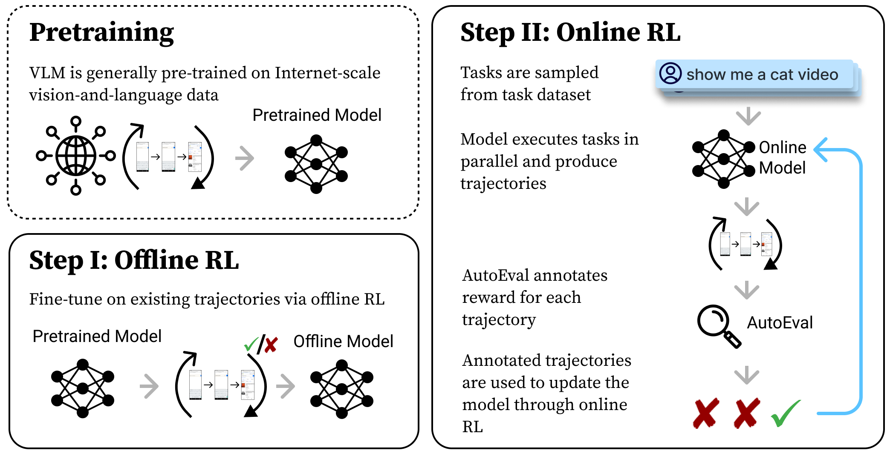

<p align="center">
    
</p>

<h3 align="center">
DigiRL: Training In-The-Wild Device-Control Agents with Autonomous Reinforcement Learning
</h3>

<p align="center">
| <a href="https://digirl-agent.github.io/"><b>Website | Demo | Results</b></a> | <a href="https://arxiv.org/abs/2406.11896"><b>Paper</b></a> | <a href="https://drive.google.com/drive/folders/14Iu6lAHePQ2qG0ghYkVG1RG6RUu7e2Hz?usp=sharing"><b>Checkpoints | Data</b></a> |
</p>

---

Research Code for preprint "DigiRL: Training In-The-Wild Device-Control Agents with Autonomous Reinforcement Learning".

[Hao Bai*](https://jackgethome.com), [Yifei Zhou*](https://<username>02.github.io/), [Mert Cemri](https://scholar.google.com/citations?user=sMEFwf8AAAAJ&hl=en), [Jiayi Pan](https://www.jiayipan.me/), [Alane Suhr](https://www.alanesuhr.com/), [Sergey Levine](https://people.eecs.berkeley.edu/~svlevine/), [Aviral Kumar](https://aviralkumar2907.github.io/)<br>
UC Berkeley, UIUC, Google DeepMind
<br>
*Equal contribution, alphabetic order; work done at UC Berkeley

<p align="center">
    
</p>

## 🍩 Features

### Environment Features

- Auto-adaptive error handling support.
- Multi-machine [emulation parallel](multimachine/README.md) support.
- Checkpoint resuming support.
- Trajectory video recording support.

### Approach Features

- Two training algorithms proposed in the paper
  - DigiRL (automatic curriculum + doubly robust estimator filtering).
  - Filtered Behavior Cloning (reward-based filtering).
- Three training modes: 
  - Offline-only training: baseline apporach - use the AutoUI checkpoint to collect data (we have this data ready for you), then train with these pre-collected sub-optimal trajectories. This mode only allows evaluation using the checkpoint.
  - Online-only training: traditional RL approach - the AutoUI checkpoint simultaneously interacts with the environment learns online. This mode allows interactive training.
  - Offline-to-online training: the most powerful approach as evaluated in paper - the AutoUI checkpoint first learns the pre-collected data, then simultanesouly interacts with the environment and do online learning starting from this checkpoint. This mode allows interactive training
- Two agents:
  - [AutoUI](https://arxiv.org/abs/2309.11436): we support both training (2 algorithms x 3 paradigms) and evaluation.
  - [CogAgent](https://arxiv.org/abs/2312.08914): current only support evaluation, no training pipeline is supported.

- Two [Android-in-the-Wild](https://arxiv.org/abs/2307.10088) task sets:
  - AitW General: general browsing, opening apps.
  - AitW Web Shopping: shopping on popular shopping websites.
  - It'll also be interesting to explore the [other AitW subsets](https://github.com/google-research/google-research/tree/master/android_in_the_wild) or other task sets  if you have good candidates, please propose one in the issue.
- DDP Multi-GPU training:
  - We support `accelerate` for multi-GPU training. You can turn off this feature if you only have 1 GPU. It only takes **12GB** of GPU memory for AutoUI running the DigiRL algorithm, but we provide this feature in case you want to play with something larger.


## 🚀 Quick Start
### Dependencies

First, create a [conda](https://conda.io/projects/conda/en/latest/user-guide/install/index.html) environment and install all pip package requirements.

```bash
conda create -n digirl python==3.10
conda activate digirl

git clone https://github.com/DigiRL-agent/digirl.git
cd digirl
pip install -e .
```

### Environment Setup

To set up the Android environment for the DigiRL/filtered BC to interact with, refer to [the environment README](./env_setup/README.md). Before moving on, you should be able to view [this screenshot](./env_setup/screenshot.png) by running [this script](./env_setup/screenshot.py).

### Model checkpoint and Datasets

The SFT checkpoint of the AutoUI model was released here and we use it:

- [AutoUI SFT checkpoint](https://huggingface.co/cooelf/Auto-UI)

Simply download `Auto-UI-Base.zip`, then unzip to a directory.

```bash
cd <path_to_autoui_dir>
wget https://huggingface.co/cooelf/Auto-UI/resolve/main/Auto-UI-Base.zip
unzip Auto-UI-Base.zip
# wait...
ls Auto-UI-Base
# config.json             pytorch_model.bin        tokenizer.json         training_args.bin
# generation_config.json  special_tokens_map.json  tokenizer_config.json
```

We provide the pre-collected trajectories using this SFT checkpoint:

- [Trajectories of SFT'ed AutoUI](https://drive.google.com/drive/folders/1ud1XyzCfh0257CixxdgLjjpX59jYbhfU?usp=sharing)

The Google Drive folder contains 4 files, with stats below (you can use `gdown` to download the checkpoint you want):

| File Name | #Trajectories | Horizon | File Size |
|-----------|---------------|---------|-----------|
| `general-off2on-zeroshot-trajectories.pt` | 608 | 10 | 95.5M |
| `general-offline-zeroshot-trajectories.pt` | 1552 | 10 | 243.9M |
| `webshop-off2on-zeroshot-trajectories.pt` | 528 | 20 | 115.2M |
| `webshop-offline-zeroshot-trajectories.pt` | 1296 | 20 | 297.5M |

where `general/webshop` mean the AitW General/Web Shopping subset, `off2on/offline` means whether the data is used for offline learning or offline-to-online learning. To make a fair comparison, offline learning should use the similar amount of data that offline-to-online learning finally uses.

Store these files into a directory:

```bash
mkdir ~/data && cd ~/data
# copy the .pt file here
```

If you want to use our final offline-to-online checkpoints to reproduce scores in the paper, you can also download from Google Drive. We release the first offline-to-online checkpoint (`run1` in paper) for each algorithm in each environment:


- [AutoUI DigiRL & online filtered BC checkpoint](https://drive.google.com/drive/folders/13jkIgWQ6JCcaTsfG_AWdgxE1qO4c2imJ?usp=sharing)

The Google Drive folder also contains 4 files:

| File Name | Index in Paper | Test Set Score | File Size |
|-----------|---------------|---------|---------|
| `general-off2on-digirl.zip` | `run1` | 70.8 | 1.9G |
| `general-off2on-filteredbc.zip` | `run1` | 59.4 | 1.9G |
| `webshop-off2on-digirl.zip` | `run1` | 75.0 | 1.9G |
| `webshop-off2on-filteredbc.zip` | `run1` | 55.2 | 1.9G |

Note that these checkpoints only allows evaluation because we only release the AutoUI checkpoint, not the optimizer states.

### Modify Configurations

Then change the `huggingface_token`, `wandb_token`, `gemini_token`, etc. in `scripts/config/main/default.yaml`, note that you need to specify **all entries** left blank or `<username>` for you in this file. This config is the default configuration - you also need to specify the subconfiguration - for example, if you want to run the online algorithm, you should also examine what to modify in `scripts/config/main/digirl_online`. Feel free to DIY your configs and play with the code!

### Run Experiments

After modifying the config to what you like, you can now run experiments with the following commands:

```bash
cd scripts
python run.py --config-path config/main --config-name digirl_online
```

The file `run.py` is the entrance of the program, and you can pass the config name to run different experiments. The config file is in `scripts/config/` directory.

### (Optional) CogAgent server

The way we set CogAgent up is using a Gradio-based API approach, which means that you need to setup CogAgent inference service on a server, then use our code to query that API. To set up CogAgent, refer to the GitHub Page of project [AutoEval](https://github.com/Berkeley-NLP/Agent-Eval-Refine/blob/main/exps/android_exp/README.md) by [Jiayi Pan](https://www.jiayipan.me/). 

Grab the link and modify that in `scripts/config/cogagent/default.yaml` file. You need at least one GPU with 48GB memory to host CogAgent for inference.

### (Optional) Multi-machine Emulation Parallel

If you want to launch large scale emulation (say more than 32 emulators running at the same time), you'll need multiple machines that collects trajectories at the same time. Refer to the [multimachine-training README](multimachine/README.md) for details.

### (Optional) Multi-GPU DDP Training

We use `accelerate` for multi-GPU DDP training. To enable, you need to identify the number of GPUs on your machine in the [accelerate config](scripts/config/accelerate_config/default_config.yaml). If you model is extremely large, it's also possible to do multi-machine DDP training but we currently don't support it.

To enable this, the only thing you need to do is to replace `python run.py` with `accelerate launch --config_file <config_file> run.py`. An example below:

```
accelerate launch --config_file config/accelerate_config/default_config.yaml run.py --config-path config/main --config-name digirl_off2on
```

You should be able to see a much faster learning speed if you've successfully set this up.


## 🌟 Contribution

We welcome the open-source community to contribute to this project. If you invented an algorithm, or you support other types of base models, please propose a PR or issue. Example topics:

- [ ] Other algorithms like PPO or any algorithm you invented.
- [ ] Other base models like LLaVA.
- [ ] Other task sets like WebArena.
- [ ] Potential sub-optimal implementations.

## 📚 Citation

Consider citing our paper!

```
@misc{bai2024digirl,
    title={DigiRL: Training In-The-Wild Device-Control Agents with Autonomous Reinforcement Learning},
    author={Hao Bai and Yifei Zhou and Mert Cemri and Jiayi Pan and Alane Suhr and Sergey Levine and Aviral Kumar},
    year={2024},
    eprint={2406.11896},
    archivePrefix={arXiv},
}
```
