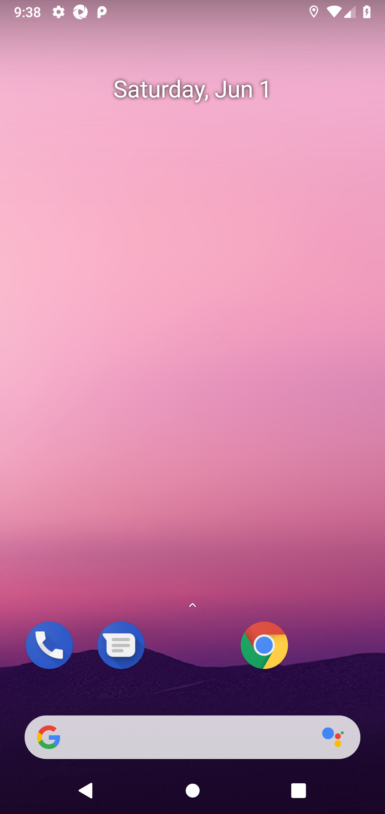
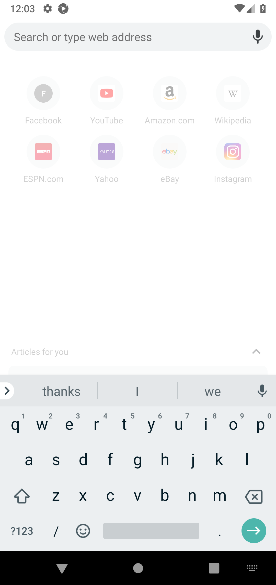

# Environment Installation Guide 

We recommend using the Linux environment. Support to Windows and MacOS are not provided, but we welcome contributions.

## Android Software Development Kit (SDK)

Part of this tutorial is based on this [GitHub Gist](https://gist.github.com/nhtua/2d294f276dc1e110a7ac14d69c37904f).

### Install Java (JDK 8)

Download a Java Development Kit 8 (v1.8.0) release version from the open-source Java releaser [OpenLogic](https://www.oracle.com/java/technologies/downloads/). Install using your Linux package installer, like `apt` or `rpm`. For example, on a Debian server:

```bash
sudo apt-get update
cd ~ && mkdir install-android/ && cd install-android
wget https://builds.openlogic.com/downloadJDK/openlogic-openjdk/8u412-b08/openlogic-openjdk-8u412-b08-linux-x64-deb.deb
sudo apt install ./openlogic-openjdk-8u412-b08-linux-x64-deb.deb
```

If you already has a java binary previously, you should also do this:

```bash
sudo update-alternatives --config java # select /usr/lib/jvm/openlogic-openjdk-8-hotspot-amd64/bin/java
```

Check whether the installation is successful by `java -version`. You should expect the output shows version 1.8.0. Higher versions makes `sdkmanager` crash.

```bash
java -version
# openjdk version "1.8.0_412-412"
# OpenJDK Runtime Environment (build 1.8.0_412-412-b08)
# OpenJDK 64-Bit Server VM (build 25.412-b08, mixed mode)
```

### Install SDK Manager

Download the Android SDK for Linux from the [official website](https://developer.android.com/studio/index.html#downloads). For your convenience, you can also directly download the [installation package](https://dl.google.com/android/repository/sdk-tools-linux-4333796.zip).

```bash
wget https://dl.google.com/android/repository/sdk-tools-linux-4333796.zip
```

Now specify the android installation path and unzip the installation package to that path. It's recommended to use `/home/<username>/.android` as the default installation path.

```bash
export ANDROID_HOME=<intended_path_here> # recommended: /home/<username>/.android
mkdir -p $ANDROID_HOME
unzip sdk-tools-linux-4333796.zip -d $ANDROID_HOME
```

Make sure you have `unzip` installed. For example, use `sudo apt install unzip -y` to install on Debian servers. To check whether the unzip is successful:

```bash
ls $ANDROID_HOME
# tools
```

### SDK Emulator

Prior to install the SDK emulators, set the environment variables:

```bash
echo "export ANDROID_HOME=$ANDROID_HOME" >> ~/.bashrc
echo 'export SDK=$ANDROID_HOME' >> ~/.bashrc
echo 'export ANDROID_SDK_ROOT=$ANDROID_HOME' >> ~/.bashrc
echo 'export PATH=$SDK/emulator:$SDK/tools:$SDK/tools/bin:$SDK/platform-tools:$PATH' >> ~/.bashrc
source ~/.bashrc
```

Now you should be able to locate the `sdkmanager` binary:

```bash
which sdkmanager
# .../tools/bin/sdkmanager
```

Then install the Android emulator 28 (other versions should also work, but the offline data we provided is in version 28):

```bash
yes | sdkmanager "platform-tools" "platforms;android-28" "emulator"
yes | sdkmanager "system-images;android-28;google_apis;x86_64"
yes | sdkmanager "build-tools;28.0.0"
```

Now you should be able to view the version of the emulator:

```bash
emulator -version
# INFO    | Storing crashdata in: /tmp/android-<username>/emu-crash-34.2.14.db, detection is enabled for process: 16670
# INFO    | Android emulator version 34.2.14.0 (build_id 11834374) (CL:N/A)
# INFO    | Storing crashdata in: /tmp/android-<username>/emu-crash-34.2.14.db, detection is enabled for process: 16670
# INFO    | Duplicate loglines will be removed, if you wish to see each individual line launch with the -log-nofilter flag.
# ...
```

## Android Virtual Device (AVD) Initialization

In the next step, we create an AVD snapshot as the environment. 

### Device Creation

Download the device image [here](https://drive.google.com/drive/folders/1ZGKrWiSoGqg8_NoIGT7rWmiZ8CXToaBF?usp=sharing).

Unzip the device image to `$ANDROID_HOME/avd`.

```bash
cd $ANDROID_HOME
mkdir avd
cd avd
unzip test_Android.zip
```

You have now successfully copied the Pixel 28 device that we use for our research.

### KVM Acceleration

In order to launch the emulator, check whether `kvm` is reachable on your machine. Simply run this command to check:

```bash
ls /dev/kvm
# /dev/kvm -> you have KVM support
# ls: cannot access '/dev/kvm': No such file or directory -> you don't have KVM support
```

If you don't have KVM support, try to enable it. During our experiments, we find that KVM virtualization makes the emulator at least 5x faster (in all aspects, including bootstrapping and interactions). **Again, failure to set up KVM is likely to backfire your research by significantly increasing the interaction time during reinforcement learning.** You can check whether you can virtualize your machine via

```bash
sudo apt-get install cpu-checker
sudo kvm-ok # yes means your machine supports virtualization
```

If your machine doesn't support virtualization, first enable this feature (this can be enabled on most virtual server providers). On GCP, for example, refer to [this guide](https://cloud.google.com/compute/docs/instances/nested-virtualization/enabling). To best of our knowledge, AWS only allows virtualization on bare metal machines, so try to set up bare metals for this research.

After checking that your machine supports virtualization, enable KVM by referring to [this guide](https://developer.android.com/studio/run/emulator-acceleration#vm-linux). If you have done all steps in this guide and you still can't set up KVM, try rebooting your machine.

### Device Bootstrapping

Now check whether you can successfully run an AVD instance with KVM acceleration by starting an emulator:

```bash
emulator -avd test_Android "-no-window" "-no-audio" "-skip-adb-auth" "-no-boot-anim" "-gpu" "auto" "-no-snapshot-load"
# ...
# Cold boot: requested by the user
# INFO    | Boot completed in 12579 ms
```

A successful launch should show `Cold boot: requested by the user` in the end. Now open a new terminal tab, you should be able to see an online devices through `adb`:

```bash
adb devices
# List of devices attached
# emulator-5554   device
```

## Remote Driver: Appium

Now **don't close the emulator** and open a new terminal tab. We use `appium` as the bind between Python (software) and the Android device (hardware). 

### Install Node.js

Appium is based on Node.js. On a Linux system, simply do

```bash
curl -fsSL https://deb.nodesource.com/setup_22.x | sudo -E bash -
sudo apt-get install -y nodejs
# the order matters, first install nodesource then install nodejs
```

Now check the installation through `node -v`:

```bash
node -v
# v18.19.0
```

### Install Appium

Now install `appium` using Node.js **globally**. Avoid local installations to avoid messing up the `digirl` repo. Also install the `uiautomator2` driver for `appium`.

```bash
sudo npm i --location=global appium
appium driver install uiautomator2
```

Now in the `digirl` conda environment, install the Python interface for Appium (you should have created the `digirl` environment in the main README):

```bash
conda activate digirl
pip install Appium-Python-Client # this should already be installed using requirements.txt, but better double-check
```

## Final Step: AVD Snapshot for Quickboot

Now we create an AVD snapshot for quickboot. This avoids bootstrapping the device every time we launch it by saving a bootstrapped snapshot.

### Install Device Interface for Appium

First, launch `appium`:

```bash
appium --relaxed-security
```

Then open a new terminal tab (now you should have 3 tabs, one running Android emulator, one running appium, and this new one) and execute the screenshot script:

```bash
# wait for half a minute... (if you do screenshot right away, you will get errors cmd: Can't find service: settings. allow some time for emulator to install the packages.)
python <path_to_digirl_repo>/env_setup/screenshot.py # keep trying this command till it no longer raises errors
# wait for half a minute...
# screenshot saved to <current_path>/screenshot.png
```

You should now see a screenshot like this: 



Now go back to the emulator terminal tab. Use `ctrl+c` to exit the emulator, and you should see 

```bash
ctrl+c
# INFO    | Saving with gfxstream=1
# ERROR   | stop: Not implemented (ignore this error)
```

Now execute this command to check whether the snapshot is successfully saved:

```bash
emulator -avd test_Android "-no-window" "-no-audio" "-skip-adb-auth" "-no-boot-anim" "-gpu" "auto" "-no-snapshot-save"
# Successfully loaded snapshot 'default_boot'
```

Congratulations! You're good to go now. Close all tabs and move on the main README for the experiments.

## Optional (Not Recommended): Create a Device from Scratch

Alternatively, you can create a device from scratch, not using our device. This may result in different behavior as our experiments, so it's not recommended for reproducing our results

### Device Creation

Create a Android 28 device from `google_apis`:

```bash
echo no | avdmanager create avd -n test_Android -k "system-images;android-28;google_apis;x86_64"
```

You should now see a directory at `$ANDOIRD_HOME/avd`. For simplicity, it's advised to set the environment variable `ANDROID_AVD_HOME` to this path:

```bash
echo 'export ANDROID_AVD_HOME=$ANDROID_HOME/avd' >> ~/.bashrc
source ~/.bashrc
```

You should now be able to see the empty AVD instance at `$ANDROID_AVD_HOME`:

```bash
ls $ANDROID_AVD_HOME
# test_Android.avd  test_Android.ini
```

To align with our experiments, replace the `$ANDROID_AVD_HOME/test_Android.avd/config.ini` file with [our released config file](./config.ini).

```bash
cp <path_to_digirl_repo>/env_setup/config.ini $ANDROID_AVD_HOME/test_Android.avd/config.ini
```

You have now successfully created an empty Pixel device image of the same configuration as the data collected in our research.

### Device Bootstrapping

Now check whether you can successfully run an AVD instance with KVM acceleration by starting an emulator:

```bash
emulator -avd test_Android "-no-window" "-no-audio" "-skip-adb-auth" "-no-boot-anim" "-gpu" "auto" "-no-snapshot-load"
# ...
# Cold boot: requested by the user
```

A successful launch should show `Cold boot: requested by the user` in the end. Now open a new terminal tab, you should be able to see an online devices through `adb`:

```bash
adb devices
# List of devices attached
# emulator-5554   device
```


### Install Device Interface for Appium

First, launch `appium`:

```bash
appium --relaxed-security
```

Then open a new terminal tab (now you should have 3 tabs, one running Android emulator, one running appium, and this new one) and execute the screenshot script:

```bash
# wait for half a minute... (if you do screenshot right away, you will get errors cmd: Can't find service: settings. allow some time for emulator to install the packages.)
python <path_to_digirl_repo>/env_setup/screenshot.py # keep trying this command till it no longer raises errors
# wait for half a minute...
# screenshot saved to <current_path>/screenshot.png
```

You should now see a screenshot like this: 


### Click Google Login in Chrome and Update Chrome

As we frequently use Chrome for our experiments, we need to ensure Chrome isn't blocked by the login interface. To complete that, we need to manually remove that in the device with ADB commands:

```bash
adb shell input tap 739 1828 # click the Chrome icon
sleep 2
adb shell input tap 654 2043 # click "accept & continue"
sleep 2
adb shell input tap 197 2066 # click "no thanks"
```

Now do the screenshot again. You should see the produced screenshot like this:


```bash
python <path_to_digirl_repo>/env_setup/screenshot.py # should work on the first try
```

```
adb shell input tap 322 719 # click the search bar
sleep 2
adb shell input tap 559 2063 # click "no"
```

Now do the screenshot again. You should see the produced screenshot like this:



```bash
python <path_to_digirl_repo>/env_setup/screenshot.py # should work on the first try
```

Then reboot the device and click the Chrome icon again. Chrome will automatically update its main page. 

```bash
adb reboot
adb devices
# ...wait until `adb device` gives `device` instead of `offline`
adb shell input tap 739 1828 # click the Chrome icon
```

Do a screenshot again. You should expect the screenshot to change to this:


```bash
python <path_to_digirl_repo>/env_setup/screenshot.py # should work on the first try
```

Now go back to home screen and save a snapshot of the device:

```bash
adb shell input tap 551 2228 # click the home button
# you can also use `adb shell input keyevent KEYCODE_HOME`
sleep 2
adb emu avd snapshot save default_boot
# OK
```

Now go back to the emulator tab. Use `ctrl+c` to exit the emulator, and you should see 

```bash
ctrl+c
# INFO    | Saving with gfxstream=1
# ERROR   | stop: Not implemented (ignore this error)
```

Now execute this command to check whether the snapshot is successfully saved:

```bash
emulator -avd test_Android "-no-window" "-no-audio" "-skip-adb-auth" "-no-boot-anim" "-gpu" "auto" "-no-snapshot-save"
# Successfully loaded snapshot 'default_boot'
```

Congratulations! You're good to go now. Close all tabs and move on the main README for the experiments.


## Optional: Useful ADB Commands

Feel free to play around ADB with these commands:

|Function|Command|
|--------|-------|
Manually save a snapshot | `adb emu avd snapshot save default_boot`
Click | `adb shell input tap 160 240`
Scroll Down | `adb shell input swipe 500 1000 300 300`
Screenshot | `adb exec-out screencap -p > screenshot.png`
Keyboard input|`adb shell input text "insert%syour%stext%shere" && adb shell input keyevent KEYCODE_ENTER`
Open Chrome | `adb shell am start -n com.android.chrome/com.google.android.apps.chrome.Main`
Open a website in Chrome |`adb shell am start -a android.intent.action.VIEW -d http://www.stackoverflow.com`
Uninstall a package | `adb shell pm uninstall --user 0 com.example.yourapp`
Install a package | `adb install -r /path/to/package`
Check application version | `adb shell dumpsys package com.example.yourapp | grep versionName`
Check Android version | `adb shell getprop ro.build.version.release`
Screen recording (high frame rate) | `adb shell screenrecord --size 540x1140 --bit-rate 4M /sdcard/video.mp4`
Pull screenshot to computer | `adb pull /sdcard/video.mp4`

### Update Google Version

Check Chrome internal version:

```bash
adb shell input tap 739 1828 # click the Chrome icon
adb shell input tap 1004 144 # click dots
adb shell input tap 510 1382 # click settings
adb shell input swipe 500 1000 300 300 # swipe down
adb shell input tap 191 2093 # click about Chrome
python env_setup/screenshot.py
```

Install a new version: you must use architecture-specific binaries. In our setup, we use the `x86/x86_64` architecture. If you use a different architecture, you must download the corresponding binaries. For example, you can download the `x86 or x86_64` version from [this page](https://www.apkmirror.com/apk/google-inc/chrome/chrome-124-0-6367-172-release/google-chrome-124-0-6367-172-6-android-apk-download/download/?key=6b3dc806b877aa88cb664103bd5e596284b12b4d&forcebaseapk=true), which will be Chrome version 124 (our paper uses Chrome 69 thought).

## Troubleshoot

### Java

```bash
sdkmanager
# Exception in thread "main" java.lang.NoClassDefFoundError: javax/xml/bind/annotation/XmlSchema
#         at com.android.repository.api.SchemaModule$SchemaModuleVersion.<init>(SchemaModule.java:156)
#         at com.android.repository.api.SchemaModule.<init>(SchemaModule.java:75)
#         at com.android.sdklib.repository.AndroidSdkHandler.<clinit>(AndroidSdkHandler.java:81)
#         at com.android.sdklib.tool.sdkmanager.SdkManagerCli.main(SdkManagerCli.java:73)
#         at com.android.sdklib.tool.sdkmanager.SdkManagerCli.main(SdkManagerCli.java:48)
# Caused by: java.lang.ClassNotFoundException: javax.xml.bind.annotation.XmlSchema
#         at java.base/jdk.internal.loader.BuiltinClassLoader.loadClass(BuiltinClassLoader.java:641)
#         at java.base/jdk.internal.loader.ClassLoaders$AppClassLoader.loadClass(ClassLoaders.java:188)
#         at java.base/java.lang.ClassLoader.loadClass(ClassLoader.java:525)
#         ... 5 more
```

This error shows because your `java` version is too new. Downgrade to Java 8.

### Emulator

```bash
emulator -avd test_Android "-no-window" "-no-audio" "-skip-adb-auth" "-no-boot-anim" "-gpu" "auto" "-no-snapshot-save"
# INFO    | Storing crashdata in: /tmp/android-<username>/emu-crash-34.2.14.db, detection is enabled for process: 29307
# INFO    | Android emulator version 34.2.14.0 (build_id 11834374) (CL:N/A)
# INFO    | Found systemPath /home/<username>/.android/system-images/android-28/google_apis/x86_64/
# INFO    | Storing crashdata in: /tmp/android-<username>/emu-crash-34.2.14.db, detection is enabled for process: 29307
# INFO    | Duplicate loglines will be removed, if you wish to see each individual line launch with the -log-nofilter flag.
# INFO    | Changing default hw.initialOrientation to portrait
# INFO    | Increasing RAM size to 1536MB
# ERROR   | x86_64 emulation currently requires hardware acceleration!
# CPU acceleration status: KVM requires a CPU that supports vmx or svm
# More info on configuring VM acceleration on Linux:
# https://developer.android.com/studio/run/emulator-acceleration#vm-linux
# General information on acceleration: https://developer.android.com/studio/run/emulator-acceleration.
```

This error shows you've not installed KVM or your machine does not support KVM. Enable KVM in this case.

```bash
emulator -avd test_Android "-no-window" "-no-audio" "-skip-adb-auth" "-no-boot-anim" "-gpu" "auto" "-no-snapshot-load"
# ...
# ProbeKVM: This user doesn't have permissions to use KVM (/dev/kvm).
```

Try two things:

```bash
sudo chown <your_username> -R /dev/kvm
sudo gpasswd -a $USER kvm
```

### Appium

```bash
python screenshot.py 
# selenium.common.exceptions.WebDriverException: Message: An unknown server-side error occurred while processing the command. Original error: Error executing adbExec. Original error: 'Command '/home/<username>/.android/platform-tools/adb -P 5037 -s emulator-5554 shell 'settings delete global hidden_api_policy_pre_p_apps;settings delete global hidden_api_policy_p_apps;settings delete global hidden_api_policy'' exited with code 20'; Command output: cmd: Can't find service: settings
```

Device is installing the Appium interface. Wait for a minute then try again.
