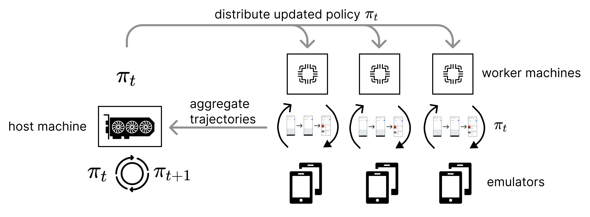

# Guidelines on Multi-Machine Emulation Parallel

We support the feature to distributedly run environment on many machines and synchronize when all collections are done. The design works as below:

<p align="center">
    
</p>

You need a host machine (with GPU) to synchronize the emulation process and train the agent, which subsequently sends the checkpoints to each worker machine (no GPU required) to simply interact with the environment to get trajectories. 

## Hands-on Guideline

**Make sure you're able to run the single-machine pipeline before you move on to multi-machine setup.**

### Configuring your cluster

First, start 1 host machine with GPU support. Then start as many worker machines as you want, where no GPU is required on these worker machines. 

Then you need to make sure all **worker machines** support to interact with the emulator (the host machine does not interact with the environment, so no need to support this). We suggest using virtual machines, so you can copy the environment directly. 

Make sure that the host machine can access all worker machines by simply `ssh` them - this can be done by adding the public keys of the worker machines to the `~/.ssh/authorized_keys` file of the host machine. This step is **mandatory** because the host machine will send the checkpoint to the worker machines and get the collected trajectories from them.

### Code Setup

Again, make sure you're able to run the single-machine pipeline on each machine before you move on.

Now copy the source code you've modified (including all the individualized changes) to each and every machine (including both host and worker machine). Note that you must set `save_freq` to `1` in multi-machine training mode (which is already set for you). Then modify the paths containing `<username>` on each machine according to their username, respectively.

Then simply run

```
cd ./script
python run.py --config-path config/multimachine --config-name host
```

The script will handle everything for you, you don't need to access any worker machine when running multi-machine emulation. Note that `bsize` in the configuration files means the number of parallel emulators on **each machine**. When there are multiple worker machines collecting trajectories parallely, the total number of parallel emulators will be the sum of `bsize` on each machine.

